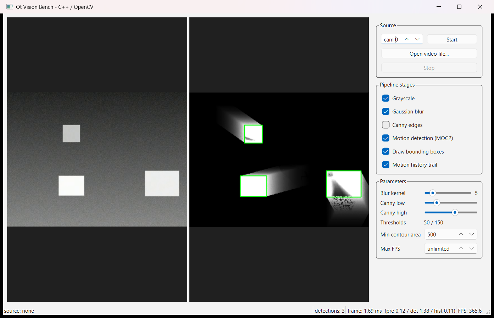
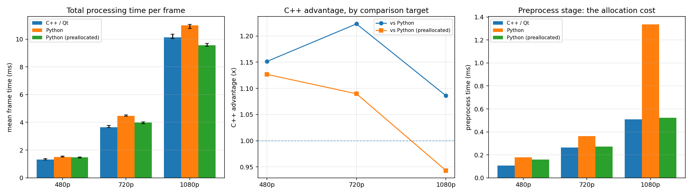
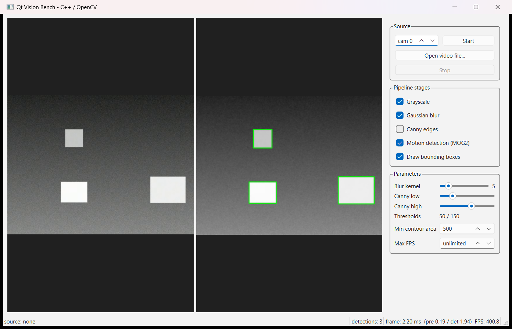

# Qt Vision Bench

A real-time motion detection tool written in C++/Qt6/OpenCV, together with a
line-by-line Python reference implementation and a benchmark harness that
measures both on identical input.



## Why this exists

During my internship at Maptech I built a real-time object detection tool in
Python. It worked, but I never knew what the language was costing me. This
project answers that question properly: the same pipeline, implemented twice,
measured on the same frames, with a correctness check proving both versions do
the same work.

The answer turned out to depend entirely on *what kind of code* you are
comparing, and that investigation is the point of the repository.

## Results

Intel Core i7-13620H, Windows 11, Release build (`-O3`), 150-frame synthetic
videos, 10 warm-up frames, median of 5 runs per cell. All variants find the
identical number of detections at every resolution; the harness refuses to
report results if they ever disagree.

### Part 1 — the pipeline as originally written

Grayscale, blur, MOG2, contours: every stage is one OpenCV call.

| Resolution | C++ (ms) | Python (ms) | Python prealloc (ms) | C++ vs Python | C++ vs prealloc |
|---|---:|---:|---:|---:|---:|
| 480p | 1.312 | 1.511 | 1.479 | 1.15x | 1.13x |
| 720p | 3.650 | 4.464 | 3.977 | 1.22x | 1.09x |
| 1080p | 10.121 | 10.991 | 9.546 | 1.09x | **0.94x** |



"Python prealloc" is the same Python file with one change: every OpenCV call
receives a reused output buffer through `dst=`, mimicking what the C++ version
does with member `cv::Mat` objects.

Against a straightforward Python translation, C++ wins by 1.09x-1.22x. Against
Python that manages its buffers the way the C++ code does, the advantage nearly
vanishes — and at 1080p it reverses. Two separate effects were hiding inside
that single number.

**Effect 1 — allocation, not language.**

| Resolution | Stage | C++ | Python | Python prealloc |
|---|---|---:|---:|---:|
| 1080p | preprocess | **0.509** | **1.337** | **0.522** |
| 1080p | detection | 9.432 | 9.143 | 8.779 |

At 1080p the preprocessing stage takes 1.337 ms in plain Python and 0.509 ms in
C++, a 2.6x gap that grows with resolution. Preallocating the buffers drops
Python to 0.522 ms — matching C++ within noise. The gap was never interpreter
speed. It was one fresh NumPy array per intermediate image per frame, a cost
that scales with pixel count, and it costs three lines to fix in Python.

**Effect 2 — the library build, not the language either.** In the detection
stage, dominated by a single MOG2 call, Python is *faster* at 1080p. That call
is native code on both sides — but not the same native code:

| | C++ side | Python side |
|---|---|---|
| OpenCV | 5.0.0 (MSYS2 package) | 4.13.0 (`opencv-python` wheel) |
| Intel IPP | **not compiled in** | **2022.2.0** |
| Parallel framework | TBB 2023.1 | Concurrency (ConcRT) |
| Baseline arch flags | `-march=nocona` (2004-era x86-64) | vendor wheel defaults |
| Compiler | gcc 16.1.0 | MSVC (wheel) |

The MSYS2 package targets a conservative CPU baseline and ships without Intel's
Performance Primitives; the official `opencv-python` wheel bundles IPP 2022.2.0.
On small frames the per-call Python overhead hides this. On 1080p frames the
IPP-accelerated kernel wins outright, in a stage where the programming language
should be irrelevant.

### Part 2 — a stage the library does not provide

The first result is only fair to C++ if the workload is representative, and a
pipeline of pure library calls is not. So I added a stage with no single OpenCV
equivalent: a motion history trail, where each frame decays the previous trail
and merges in the current mask.

```
history[p] = max((history[p] * decay) >> 8, mask[p])
```

C++ does this in one pass with no temporaries. NumPy needs four passes —
multiply, shift, maximum, write back — because each operation is a separate
whole-array traversal. Same arithmetic, same result, different structure.

| Resolution | C++ (ms) | Python (ms) | Python prealloc (ms) | C++ advantage |
|---|---:|---:|---:|---:|
| 480p | 0.120 | 0.646 | 0.732 | **5.4x** |
| 720p | 0.321 | 2.455 | 2.396 | **7.6x** |
| 1080p | 0.790 | 5.114 | 4.675 | **6.5x** |

Preallocation does not rescue Python here, and at 480p it is slightly slower —
the extra write-back pass costs more than the allocation it saves. The
bottleneck is the number of traversals, which is a property of how NumPy
expresses the computation, not of memory management.

With this one stage enabled, the whole-pipeline picture changes:

| Resolution | C++ (ms) | Python (ms) | Python prealloc (ms) | C++ vs Python | C++ vs prealloc |
|---|---:|---:|---:|---:|---:|
| 480p | 1.441 | 2.326 | 2.189 | 1.61x | 1.52x |
| 720p | 4.050 | 7.149 | 6.660 | 1.76x | 1.64x |
| 1080p | 11.028 | 16.134 | 14.365 | 1.46x | 1.30x |

### What I take from this

> Against carefully written Python, the C++ port is worth **1.1x or less** on
> stages that are thin wrappers over OpenCV — and at 1080p it loses. On the
> stage where I write the pixel logic myself it is worth **6x**. "Rewrite it in
> C++" is not a throughput argument for a pipeline of library calls; it is a
> throughput argument for the code you actually write.

The practical version, for the tool this started from: the Python original was
leaving 10-13% on the table at 720p and above for want of three `dst=`
arguments, and would have gained a real multiple only on the parts that were
never library calls to begin with.

Reproduce with `py bench/sweep.py --repeat 5` and
`py bench/sweep.py --repeat 5 --history`. Raw measurements land in
[`bench/sweep.json`](bench/sweep.json) and
[`bench/sweep_history.json`](bench/sweep_history.json).

## What the pipeline does

```
frame -> grayscale -> Gaussian blur -> MOG2 background subtraction
      -> morphological opening -> contours -> area filter -> bounding boxes
      -> [optional] motion history trail
```

Canny edge detection is available as an alternative output view. Every stage
can be toggled and tuned live from the UI, which is the point of having a UI at
all: parameters like the minimum contour area are impossible to pick without
watching them work.

The default view, without the trail stage, shows the processed frame and the
detected boxes side by side with the source:



## Architecture

| File | Responsibility |
|---|---|
| `src/pipeline.h/.cpp` | The image processing pipeline. **Contains no Qt code.** |
| `src/worker.h/.cpp` | Frame capture and processing on a dedicated thread. |
| `src/mainwindow.h/.cpp` | UI, controls, live statistics. |
| `src/main.cpp` | Entry point, argument parsing, headless benchmark mode. |
| `tests/test_pipeline.cpp` | Unit tests, no framework dependency. |
| `bench/baseline.py` | The same pipeline in Python, with and without buffer reuse. |
| `bench/compare.py` | Quick single-resolution run with a parity check. |
| `bench/sweep.py` | All three variants across resolutions; tables and charts. |

Three decisions worth explaining:

**The pipeline is Qt-free.** That is what lets the same code run under the GUI,
under the headless benchmark, and under unit tests without a display.

**Capture runs on a worker thread, driven by a timer rather than a loop.** A
`while(true)` loop inside a slot would block that thread's event loop, so
`stop()` and parameter changes would never arrive. With a zero-interval
`QTimer`, the event loop breathes between frames — which also means the config
can be updated through queued signals with no mutex anywhere.

**Detections are suppressed during warm-up.** A freshly reset MOG2 model reports
the entire first frame as foreground. Without suppression, switching video
sources paints a bounding box around the whole screen. This was caught by a unit
test, not by watching the app.

## Building

Requires MSYS2 with the UCRT64 toolchain. From an MSYS2 UCRT64 shell:

```bash
./scripts/install_deps.sh   # first time only
./scripts/build.sh          # configure, build, run tests
```

Or manually:

```bash
cmake -G Ninja -B build -DCMAKE_BUILD_TYPE=Release
cmake --build build
ctest --test-dir build --output-on-failure
```

The build is warning-clean with `-Wall -Wextra -Wpedantic`.

## Running

```powershell
.\scripts\run.ps1
```

From an MSYS2 UCRT64 shell the executable also runs directly:

```bash
./build/qt_vision_bench.exe                               # GUI
./build/qt_vision_bench.exe --video bench/test_video.mp4  # GUI, start on a file
./build/qt_vision_bench.exe --history                     # GUI with the trail stage
./build/qt_vision_bench.exe --bench bench/test_video.mp4  # headless, prints JSON
```

## Reproducing the benchmark

```powershell
py bench/make_test_video.py              # 480p sample for the single-resolution run
py bench/compare.py                      # one resolution, quick
py bench/sweep.py --repeat 5             # library-call pipeline
py bench/sweep.py --repeat 5 --history   # with the hand-written stage
```

The test videos are synthetic and generated from a fixed seed, so anyone cloning
this repository measures the same frames, the same motion, and the same noise. A
recorded clip would have made the numbers machine-dependent for no benefit.

Both harness scripts exit non-zero if the implementations disagree on the number
of detections. A speed comparison between pipelines that are not doing the same
work is worthless, so the parity check gates the result rather than sitting in a
footnote.

## Limitations

- **The two sides link different OpenCV builds**, as analysed above. Until they
  are built from source with matching flags, the detection-stage numbers
  describe packaging, not language. The Part 2 result does not depend on this,
  since that stage calls no library at all.
- Parity is checked on detection counts, not on the motion-history image. The
  decay arithmetic is asserted identically in both a C++ unit test and a Python
  check, but the two trail images are never compared pixel by pixel.
- Single machine, single scene, three resolutions.
- Timing covers the processing pipeline only; video decode is excluded from
  `process_ms` and included in `end_to_end_fps`.

## Next steps

- Build both sides against one OpenCV compiled from source with identical flags,
  then re-run Part 1. This is the only way to isolate the language there.
- Compare the motion-history images pixel by pixel and add that to the parity
  gate.
- Try the same stage in Numba or Cython. If a JIT closes the 6x gap, the
  conclusion changes from "use C++" to "use C++ or stop writing loops in NumPy".
